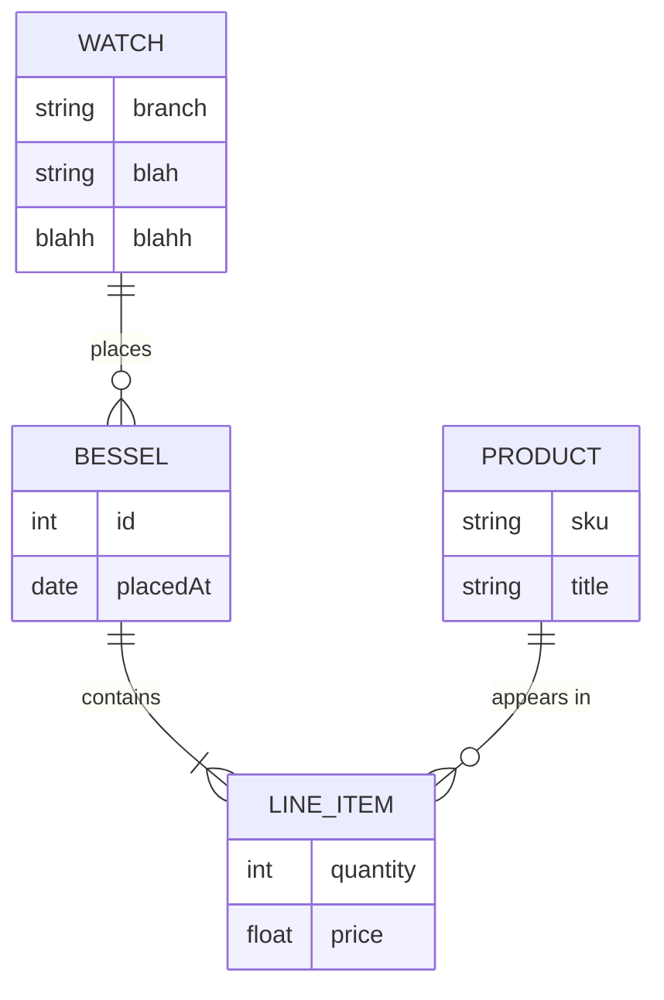

```mermaid
---
config:
  theme: default
  look: classic
  layout: dagre
---
erDiagram
  WATCH ||--o{ BESSEL : places
  BESSEL ||--|{ LINE_ITEM : contains
  PRODUCT ||--o{ LINE_ITEM : "appears in"
  WATCH {
    string branch 
    string blah blahh blahh
  }
  BESSEL {
    int id
    date placedAt
  }
  LINE_ITEM {
    int quantity
    float price
  }
  PRODUCT {
    string sku
    string title
  }
```
